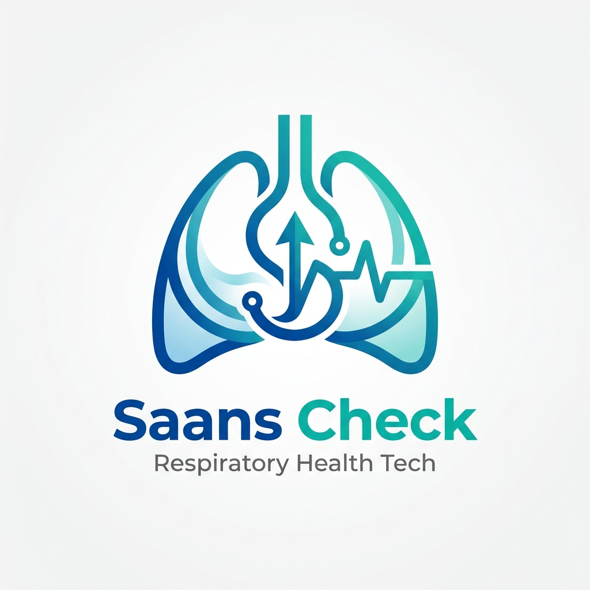
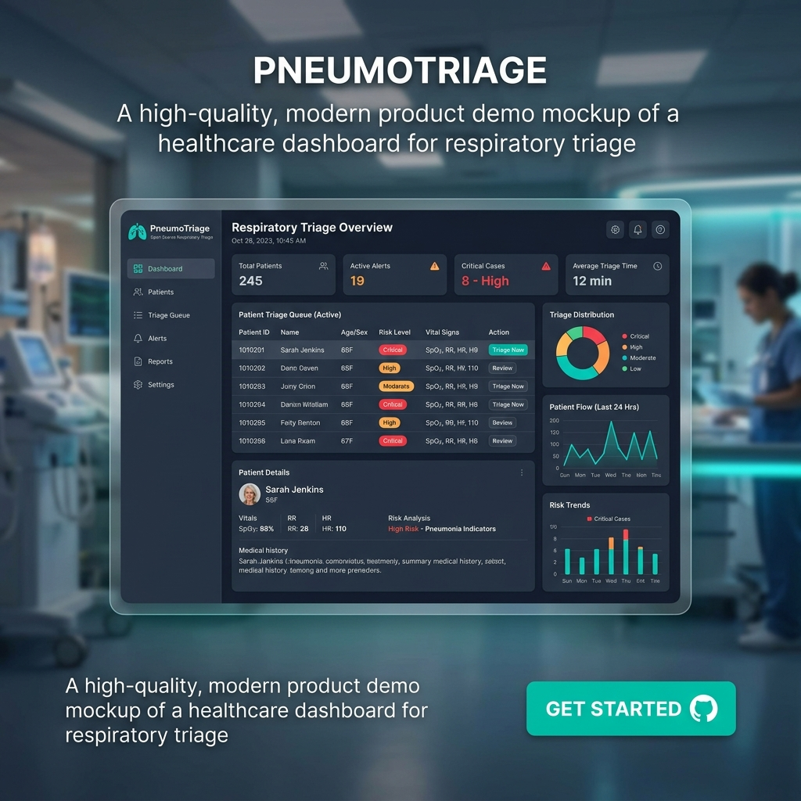

<div align="center">
  
  <h1>Saans Check 🫁</h1>
  <p><b>A privacy-preserving, acoustic respiratory triage tool for occupational lung disease screening.</b></p>

  <!-- Badges -->
  <a href="https://github.com/your-username/saans-check/stargazers"></a>
  <a href="https://github.com/your-username/saans-check/network/members"></a>
  <a href="https://github.com/your-username/saans-check/issues"></a>
  <a href="https://github.com/your-username/saans-check/blob/master/LICENSE"></a>
</div>

<br />

> ⚠️ **BUILDING PHASE NOTICE** 
> This project is currently in the active building phase. The machine learning classifier is a proxy model trained on public TB/COVID datasets and **is not a validated silicosis detector**. It serves as a proof-of-concept for camp prioritization. Do not use this tool for medical diagnosis. See [PRD](docs/PRD.md) for full context.

Saans Check is an open-source, mobile-web platform designed to help NGOs and welfare boards prioritize where to deploy medical camps (X-ray/spirometry trucks) in high-risk occupational environments (e.g., mines, quarries in Rajasthan, India). It combines a worker-facing audio intake flow with privacy-preserving aggregation to build a dashboard for camp prioritization.

---

## 🌟 Product Demo

<div align="center">
  
</div>

---

## 🏗️ Project Structure

The project has been reorganized into standard components to ensure maintainability and separation of concerns:

- **`frontend/`** (BUILT): The React (Vite) frontend. Includes the mobile-web worker intake flow and the NGO hotspot dashboard.
- **`backend/`** (BUILT): The core FastAPI backend. Handles privacy-safe data aggregation and serving the API.
- **`ml-pipeline/`** (BUILT): The YAMNet embedding and generic respiratory-distress classifier pipeline. Acts as an honest proxy until real silicosis data is acquired.
- **`clinical-pilot/`** (SCAFFOLDED): Tools for a future clinical partnership, including consent forms and retraining scripts for paired X-ray/audio data.
- **`future-scale/`** (SPEC'D): Upgrade paths including Google HeAR embeddings, regulatory pathway worksheets, and state portal integrations.

---

## 📐 System Architecture

For a detailed view of the End-to-End Pipeline and the Privacy Boundary Data Flow, please check our [Architecture Documentation](docs/architecture.md).

---

## 🚀 Getting Started

### Local Development

1. **Frontend:**
   ```bash
   cd frontend
   npm install
   npm run dev
   ```
   The local frontend dev server uses port `5174` (or `5173`).

2. **Backend:**
   ```bash
   cd backend
   pip install -r ../requirements.txt
   uvicorn app.main:app --port 8000 --reload
   ```
   The backend uses port `8001` (or `8000`).

---

## ☁️ Deployment

A decoupled demo of the Intake App & Dashboard is designed to be easily deployed to Vercel. 

### Vercel Setup (Demo Mode)
Because the full machine learning model exceeds Vercel's Serverless Function limits (250MB), the Vercel deployment runs in an "exposure-only" graceful degradation mode.

1. `vercel.json` handles routing.
2. `api/index.py` exposes the FastAPI app.
3. `requirements.txt` installs lightweight dependencies only.

```bash
npm i -g vercel
vercel deploy --prod
```

---

## 🔮 Future Roadmap (Phase 4)

1. **Google HeAR embedding upgrade (`future-scale/hear_migration/`)**  
   YAMNet → HeAR swap-in, ready to activate once Google grants access.
2. **Regulatory self-assessment worksheet (`future-scale/cdsco_pathway/`)**  
   Organizes the classification question against CDSCO's draft guidance.
3. **State portal integration spec (`future-scale/state_integration/`)**  
   Documents aggregate-only data flow specs for future partnerships.

---
<div align="center">
  <i>Built with ❤️ for occupational health and privacy.</i>
</div>
