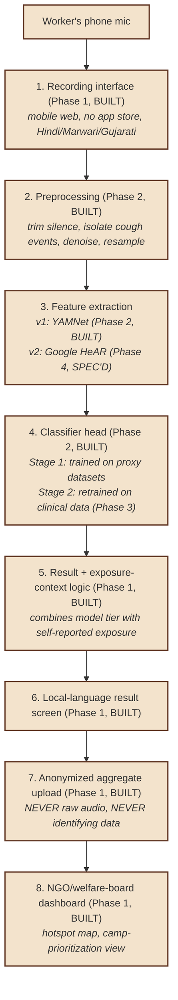
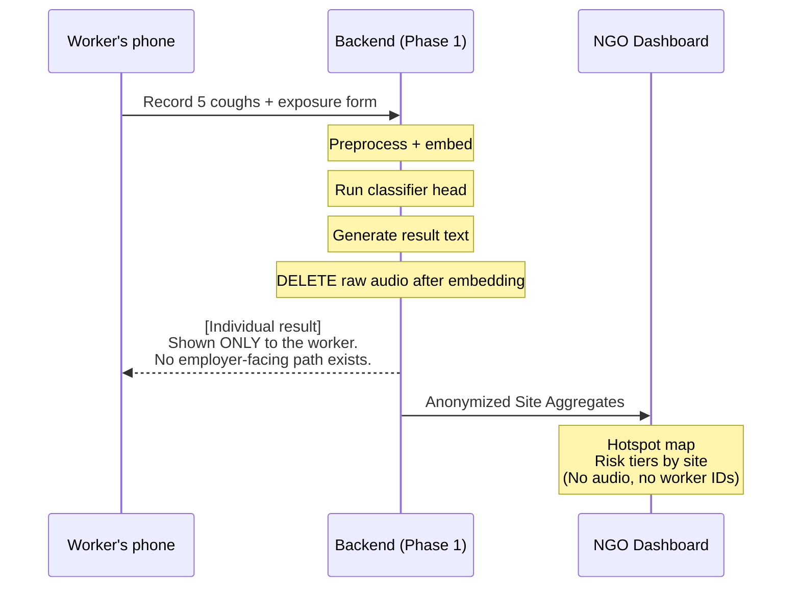

# System Architecture — All Phases

## End-to-end pipeline (per PRD §4.1)

## Why Phase 1 and Phase 2 are decoupled

Phase 1 (intake + dashboard) makes zero AI claims and is valuable on its own — the PRD is
explicit about this (§6, Phase 1 goal: "ship the wedge that doesn't depend on the model
working"). The backend API is built so the classifier result is an *optional field* on a
submission, not a required one. If Phase 2's model never clears validation, Phase 1 ships and
operates standalone with structured self-report data alone, exactly as the PRD's exit
criterion (b) describes.

## Why the classifier head is small (per PRD §4.2.D)

The embedding layer (YAMNet now, HeAR later) is a frozen, pretrained, self-supervised model —
it is not retrained by this project. The only thing this project trains is a small classifier
head (logistic regression / SVM / shallow MLP) on top of those frozen embeddings. This is
deliberate: with low hundreds of labeled examples (the realistic Stage 2 ceiling — see
`phase3-clinical-pilot/data_schema/sample_size_notes.md`), a large fine-tuned network overfits
and a small linear/shallow head generalizes better. There is no LLM anywhere in the disease
classification path — this is binary/few-class audio classification on fixed-size embeddings,
not language generation. (The optional LLM-powered result-phrasing layer, used only to translate
a *fixed, pre-approved* set of result strings into natural local-language phrasing, is described
separately in `phase1-intake-app/backend/app/result_copy.py` and never sees raw model scores.)

## Data flow and privacy boundary

This boundary — raw audio deleted post-embedding by default, individual results never leaving
the worker's device, only site-level aggregates reaching the dashboard — is implemented in
`phase1-intake-app/backend/app/privacy.py` and is not optional/configurable by a deploying
organization without an explicit code change, by design (see PRD §4.3 and §5).

## Phase 3/4 integration points (specified, not yet activated)

- **Phase 3** plugs into step 4 above: the *same* classifier-head training code
  (`phase2-proxy-classifier/src/train_classifier.py`) is reused, pointed at a different,
  paired-clinical dataset once one exists. See `phase3-clinical-pilot/scripts/retrain_stage2.py`
  — it imports directly from the Phase 2 module rather than forking it, so Stage 1 → Stage 2 is
  a data swap, not a rewrite.
- **Phase 4 (HeAR)** plugs into step 3: `phase4-scale/hear_migration/hear_embedder.py`
  implements the same interface as `phase2-proxy-classifier/src/embed_yamnet.py`
  (`embed(audio_array, sample_rate) -> np.ndarray`), so the classifier head doesn't need to
  change at all when the embedding backend changes.
- **Phase 4 (CDSCO)** is a standalone worksheet — see `phase4-scale/cdsco_pathway/` — since
  regulatory classification is a legal determination this repo cannot make, only document.
- **Phase 4 (state portal)** is an integration spec — see `phase4-scale/state_integration/` —
  since it requires API credentials this project does not have and a government partnership
  this project has not yet secured (per the Phase 0 outreach status).
